# Lab5Web
## Ananda Fachri Reynaldi
## 312110248
## TI.21.B1

<b>Laporan Praktikum</b>

1. Membuat Dokumen HTML Baru Dengan Nama File lab5_javascript.html

<b>JavaScript Dasar</b>

2. Pemakaian Alert Sebagai Property Window

3. Pemakaian Method Dalam Objek
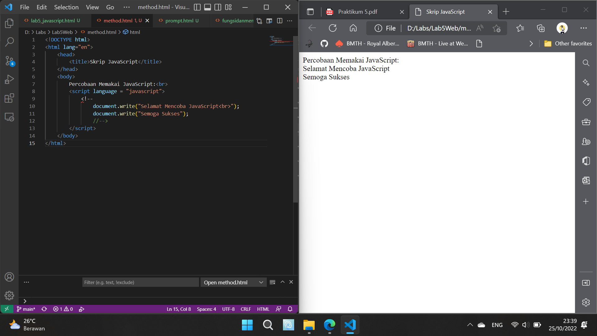
4. Pemakaian Prompt
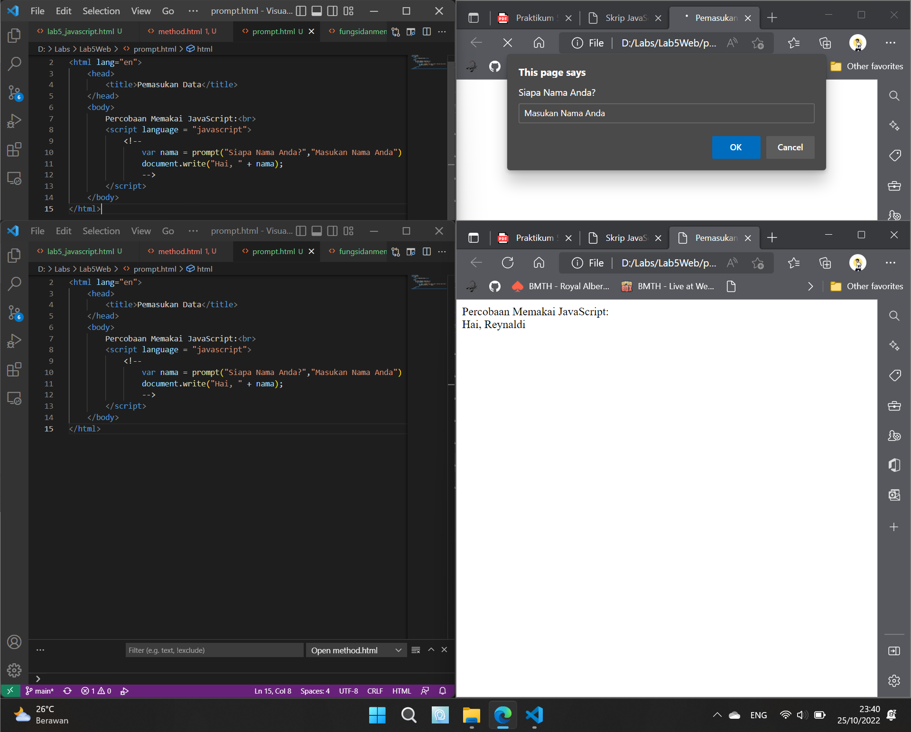
5. Pembuatan Fungsi dan Cara Pemanggilannya
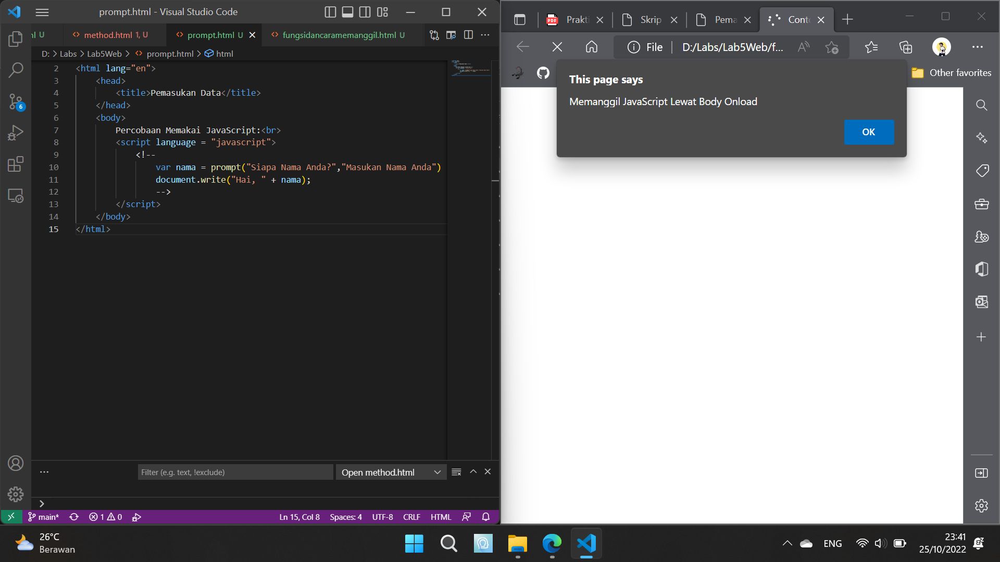

<b>Dasar Pemrograman di JavaScript</b>

6. Operasi Dasar Aritmatika
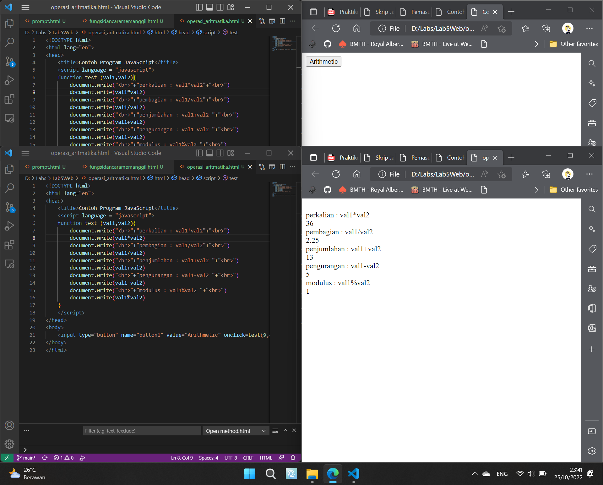
7. Seleksi Kondisi (if..else)
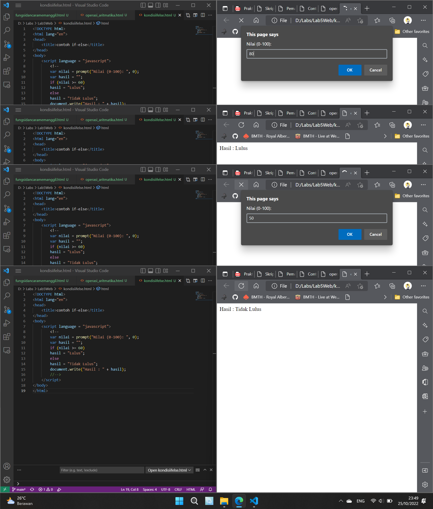
8. Penggunaan Operator Switch Untuk Seleksi Kondisi
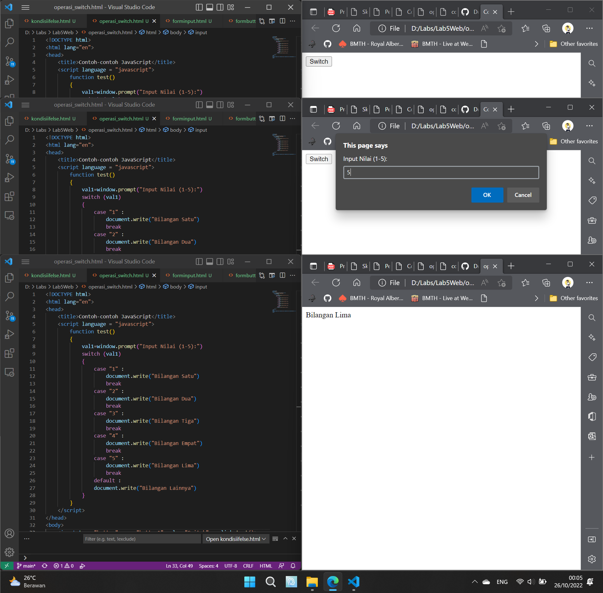

<b>Pembuatan Form</b>

9. Form Input
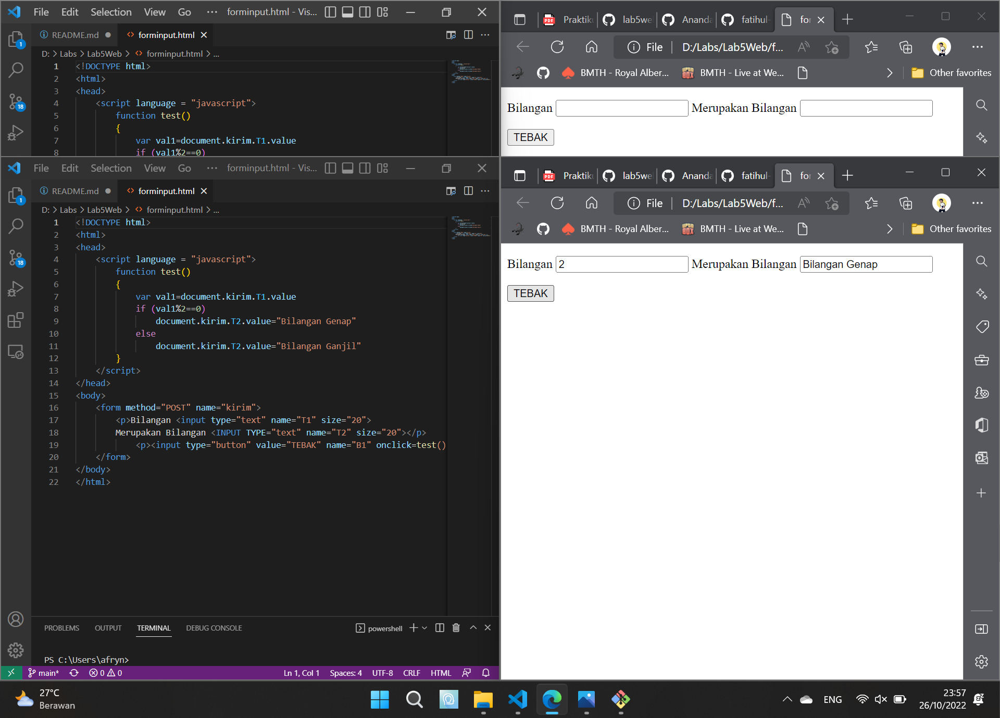
10. Form Button
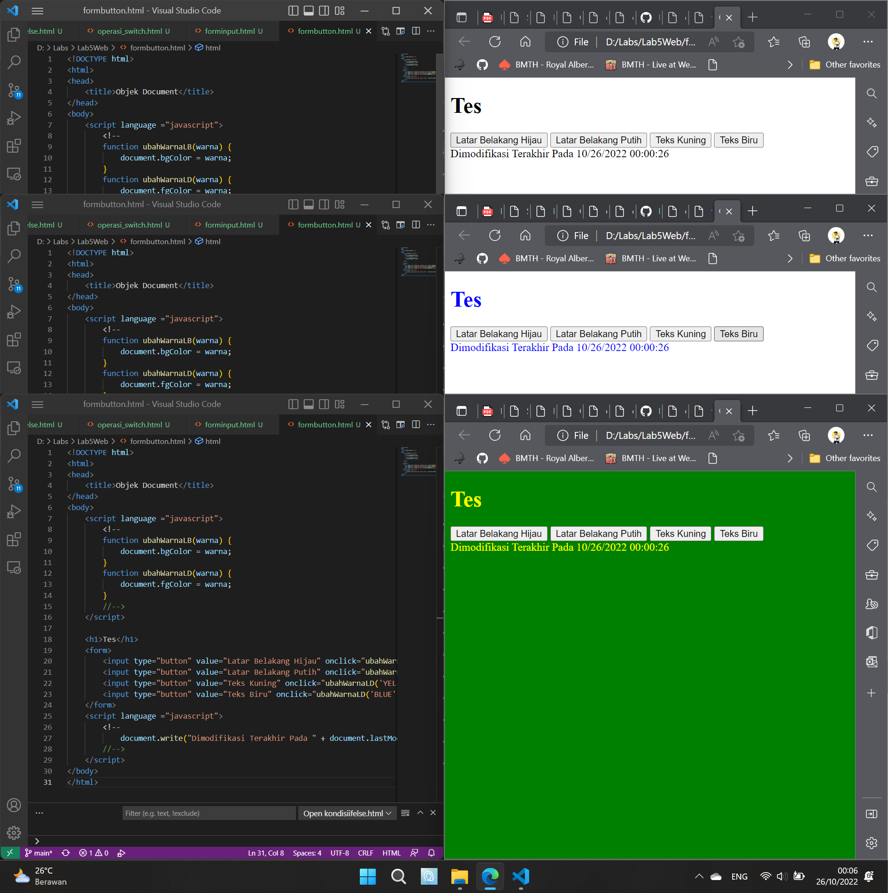

<b>HTML DOM</b>

11. Pilihan Menggunakan CheckBox dengan Perhitungan Otomatis
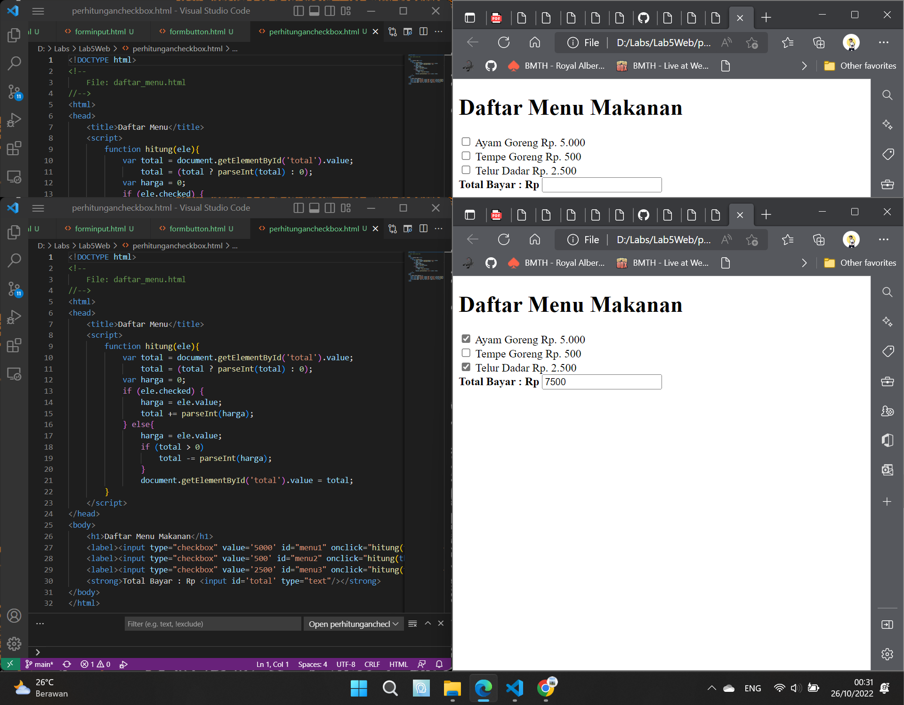

<b>Pertanyaan dan Tugas</b>

1. Buat Script Untuk Melakukan Validasi Pada Isian Form  
Menggunakan Alert Box Untuk Mengingatkan User Untuk Mengisi Semua Kolom
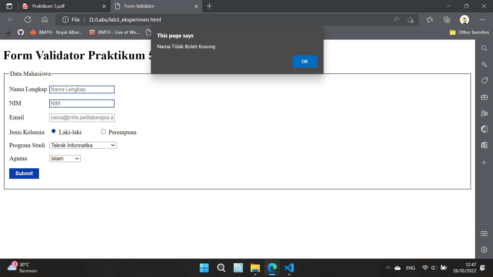
Pada Kolom Email Menggunakan Type Input Email, Sehingga User Harus Menginput Email yang Valid.
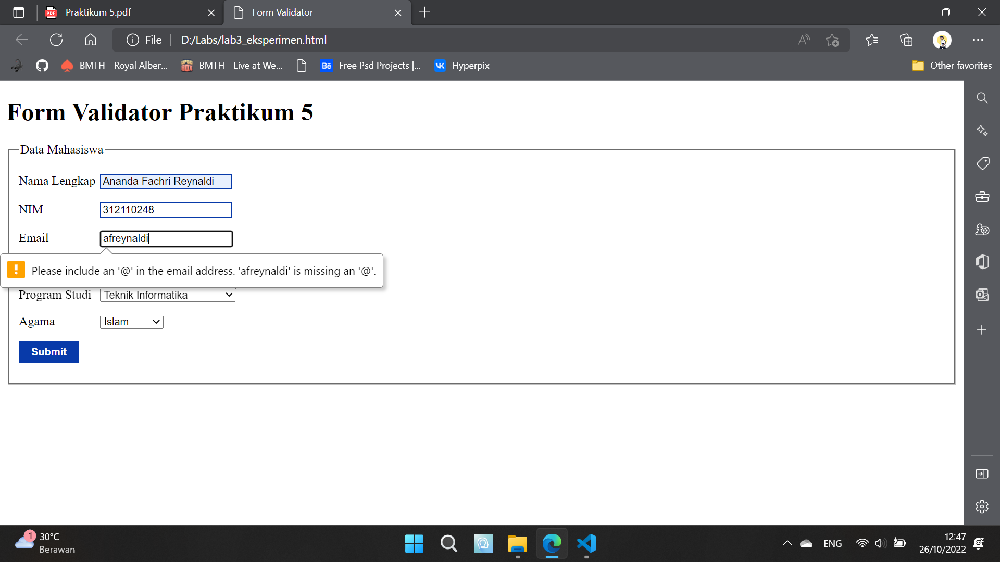
Terakhir Mengisi Semua Kolom
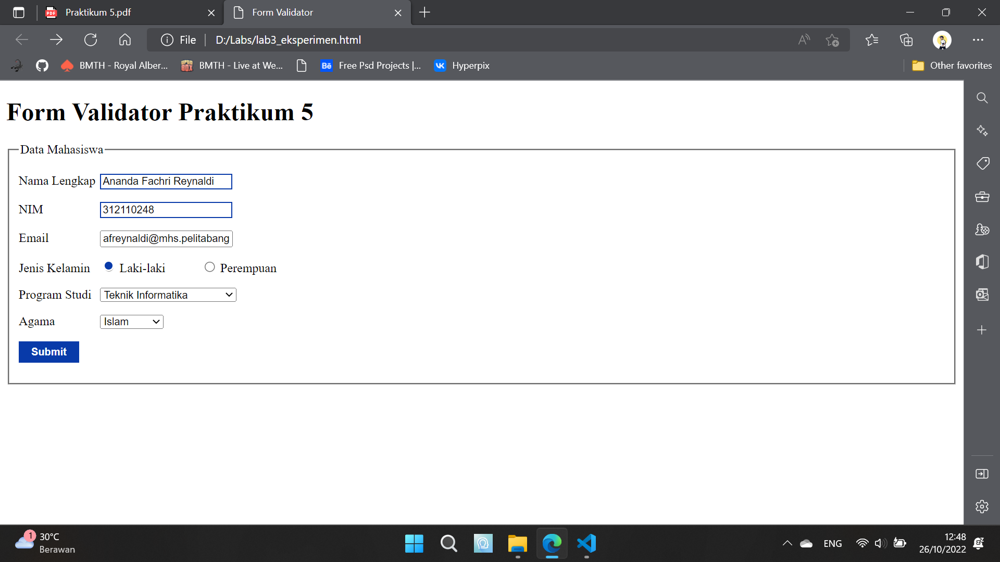